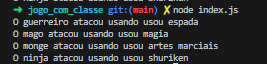
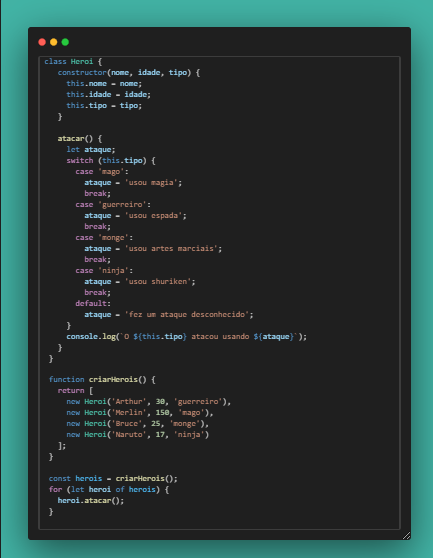
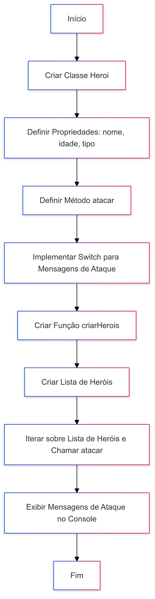

# 🛡️ Jogo de Aventura com Heróis

## 📜 Descrição

Este projeto implementa um jogo de aventura onde heróis de diferentes tipos podem atacar usando suas habilidades específicas. A classe `Heroi` representa um herói genérico com propriedades como `nome`, `idade` e `tipo`. Cada herói pode realizar um ataque que exibe uma mensagem específica baseada no seu tipo.

## 🚀 Funcionalidades

- **Variáveis**: Utilizadas para armazenar as propriedades dos heróis.
- **Operadores**: Utilizados para concatenar strings nas mensagens de ataque.
- **Laços de Repetição**: Utilizados para iterar sobre uma lista de heróis e chamar o método `atacar`.
- **Estruturas de Decisão**: Utilizadas para determinar a mensagem de ataque com base no tipo do herói.
- **Funções**: Função `criarHerois` para criar uma lista de heróis.
- **Classes e Objetos**: Classe `Heroi` para representar os heróis e seus comportamentos.

## 🛠️ Tecnologias Utilizadas

- JavaScript

## 📋 Requisitos

- Node.js instalado

## 📦 Como Executar

1. Clone o repositório:

   ```bash
   git clone https://github.com/GrazielleNascimento/jogo_com_classe.git
   ```

2. Navegue até o diretório do projeto:

     ```sh
       cd jogo_com_classe
     ```

3. Instale as dependências

     ```sh
       npm install
    ```

   ## 🚀 Execução

   Para executar o projeto, use o comando:

    ```sh
   node index.js
    ```

   ## 💻 Exemplo de Execução

   

   ## 👩‍💻 Código

   

   ## 📊 Fluxograma do Projeto

   
